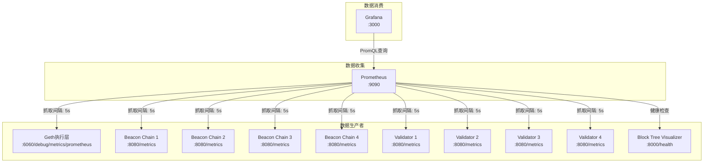

# Grafana仪表板数据分析

## 📊 概览

您的系统中有两个主要的Grafana仪表板，它们从不同的数据源获取数据，并进行不同类型的处理：

1. **Consensus Overview** - 基于Prometheus指标的传统监控仪表板
2. **Block Tree Overview** - 整合区块树可视化的混合仪表板

## 🔍 数据源架构



## 📋 仪表板1: Consensus Overview

### 数据源
- **类型**: Prometheus时序数据库
- **来源**: Prysm beacon-chain 和 Geth 指标
- **更新频率**: 5秒抓取间隔
- **数据格式**: 标准Prometheus指标

### 面板分析

#### 1. **Finalized Epoch** (统计面板)
```promql
max(beacon_finalized_epoch)
```
- **数据来源**: beacon节点的finalized_epoch指标
- **处理方式**: 取所有节点中的最大值
- **含义**: 当前网络的最终化epoch
- **更新**: 实时更新

#### 2. **Head Slot** (统计面板)
```promql
max(beacon_head_slot)
```
- **数据来源**: beacon节点的head_slot指标
- **处理方式**: 取所有节点中的最大值
- **含义**: 当前网络的头部槽位
- **更新**: 实时更新

#### 3. **Participation Rate** (时序图)
```promql
# Target投票参与率
beacon_prev_epoch_target_gwei / beacon_prev_epoch_active_gwei

# Head投票参与率  
beacon_prev_epoch_head_gwei / beacon_prev_epoch_active_gwei

# Source投票参与率
beacon_prev_epoch_source_gwei / beacon_prev_epoch_active_gwei
```
- **数据来源**: beacon节点的投票统计指标
- **处理方式**: 比值计算（投票权重/活跃权重）
- **含义**: 验证者在上一epoch的投票参与率
- **分类**: 按照投票类型分为target、head、source三种

#### 4. **Fork Switches** (时序图)
```promql
sum(rate(doublylinkedtree_head_changed_count[5m]))
```
- **数据来源**: beacon节点的头部切换计数器
- **处理方式**: 5分钟内的变化率求和
- **含义**: 分叉事件频率（头部切换次数）
- **单位**: 次/秒

#### 5. **Attestation Inclusion Delay** (时序图)
```promql
# 50%分位数
histogram_quantile(0.5, sum by (le) (rate(attestation_inclusion_delay_slots_bucket[5m])))

# 95%分位数
histogram_quantile(0.95, sum by (le) (rate(attestation_inclusion_delay_slots_bucket[5m])))
```
- **数据来源**: beacon节点的证明包含延迟直方图
- **处理方式**: 分位数计算
- **含义**: 证明被包含到区块中的延迟时间
- **单位**: 槽位数

#### 6. **Block Propagation Delay** (时序图)
```promql
# 50%分位数
histogram_quantile(0.5, sum by (le) (rate(block_arrival_latency_milliseconds_bucket[5m])))

# 95%分位数  
histogram_quantile(0.95, sum by (le) (rate(block_arrival_latency_milliseconds_bucket[5m])))
```
- **数据来源**: beacon节点的区块传播延迟直方图
- **处理方式**: 分位数计算
- **含义**: 区块在网络中的传播延迟
- **单位**: 毫秒

#### 7. **Connected Peers** (时序图)
```promql
max(connected_libp2p_peers)
```
- **数据来源**: beacon节点的libp2p连接数
- **处理方式**: 取最大值
- **含义**: 网络中连接的对等节点数

#### 8. **Geth CPU Usage** (时序图)
```promql
rate(process_cpu_seconds_total{job="geth"}[1m]) * 100
```
- **数据来源**: Geth执行层的CPU使用时间
- **处理方式**: 1分钟变化率乘以100
- **含义**: Geth进程的CPU使用百分比

## 📋 仪表板2: Block Tree Overview

### 数据源
- **类型**: 混合数据源（Prometheus + 区块树可视化器）
- **来源**: Prometheus指标 + Fork Choice API数据
- **更新频率**: Prometheus 5秒 + 可视化器2秒
- **数据格式**: Prometheus指标 + JSON数据

### 面板分析

#### 1. **头部槽位进展** (时序图)
```promql
beacon_head_slot
```
- **数据来源**: 与Consensus Overview相同
- **处理方式**: 按节点实例分组显示
- **含义**: 展示每个节点的头部槽位进展
- **增强**: 显示节点实例标签

#### 2. **最终化Epoch** (统计面板)
```promql
max(beacon_finalized_epoch)
```
- **数据来源**: 与Consensus Overview相同
- **处理方式**: 相同的最大值计算

#### 3. **确认Epoch** (统计面板)
```promql
max(beacon_justified_epoch)
```
- **数据来源**: beacon节点的justified_epoch指标
- **处理方式**: 取最大值
- **含义**: 当前网络的确认epoch

#### 4. **验证者参与率** (时序图)
```promql
# 与Consensus Overview相同的查询
beacon_prev_epoch_target_gwei / beacon_prev_epoch_active_gwei
beacon_prev_epoch_head_gwei / beacon_prev_epoch_active_gwei  
beacon_prev_epoch_source_gwei / beacon_prev_epoch_active_gwei
```
- **数据来源**: 与Consensus Overview相同
- **处理方式**: 相同的比值计算

#### 5. **分叉事件频率** (时序图)
```promql
sum(rate(doublylinkedtree_head_changed_count[5m]))
```
- **数据来源**: 与Consensus Overview相同
- **处理方式**: 相同的变化率计算

#### 6. **区块树可视化入口** (HTML面板)
- **数据来源**: 静态HTML内容
- **处理方式**: 提供链接和说明文档
- **功能**: 
  - 直接链接到区块树可视化界面 (http://localhost:8888)
  - 链接到Fork Choice API (http://localhost:8888/api/fork-choice)
  - 功能特性说明

## 🔧 区块树可视化器数据处理

### 数据获取流程

#### 1. **Fork Choice API数据收集**
```python
# 每2秒从所有beacon节点收集数据
for endpoint in ["http://beacon-chain-1:7777", "http://beacon-chain-2:7777", 
                 "http://beacon-chain-3:7777", "http://beacon-chain-4:7777"]:
    url = f"{endpoint}/eth/v1/debug/fork_choice"
    data = await session.get(url)
```

#### 2. **数据解析和结构化**
```python
def _parse_fork_choice_data(self, raw_data: dict) -> ForkChoiceData:
    nodes = []
    for node_data in raw_data.get('fork_choice_nodes', []):
        node = BlockNode(
            slot=node_data.get('slot', '0'),
            block_root=node_data.get('block_root', ''),
            parent_root=node_data.get('parent_root', ''),
            justified_epoch=node_data.get('justified_epoch', '0'),
            finalized_epoch=node_data.get('finalized_epoch', '0'),
            weight=node_data.get('weight', '0'),
            validity=node_data.get('validity', 'unknown'),
            # ... 更多字段
        )
```

#### 3. **前端数据处理**
```javascript
processData(endpointData) {
    const { nodes, head_root, finalized_checkpoint, justified_checkpoint } = endpointData;
    
    // 构建节点数据
    this.nodes = nodes.map(node => ({
        id: node.block_root,
        slot: parseInt(node.slot),
        weight: parseInt(node.weight),
        isHead: node.block_root === head_root,
        isFinalized: parseInt(node.finalized_epoch) >= finalizedEpoch,
        isJustified: parseInt(node.justified_epoch) >= justifiedEpoch,
        // ... 状态判断
    }));
    
    // 构建连接关系
    this.links = nodes.map(node => ({
        source: node.parent_root,
        target: node.id,
        isFinalized: node.isFinalized && parentNode.isFinalized
    }));
}
```

## 📊 数据对比分析

| 特性 | Consensus Overview | Block Tree Overview |
|------|-------------------|---------------------|
| **数据源** | 纯Prometheus指标 | Prometheus + Fork Choice API |
| **更新频率** | 5秒 | 5秒（指标）+ 2秒（可视化） |
| **数据粒度** | 聚合统计数据 | 个体区块数据 |
| **处理复杂度** | 简单的PromQL查询 | 复杂的图形数据处理 |
| **可视化类型** | 传统监控图表 | 交互式区块树 |
| **实时性** | 高（直接查询） | 高（WebSocket推送） |
| **历史数据** | 完整时序数据 | 当前状态快照 |

## 🎯 数据使用场景

### Consensus Overview 适用于：
- 🔍 **网络健康监控**: 整体参与率、延迟分析
- 📈 **性能趋势分析**: 长期性能指标趋势
- 🚨 **告警和报警**: 基于阈值的监控告警
- 📊 **运维仪表板**: 日常运维监控面板

### Block Tree Overview 适用于：
- 🌳 **区块结构分析**: 具体的区块链结构和分叉
- 🔗 **最终化跟踪**: 实时的最终化过程可视化
- 🐛 **问题诊断**: 分叉事件的详细分析
- 🎓 **教学演示**: 区块链工作原理的直观展示

## 💡 优化建议

1. **数据查询优化**:
   - 对于高频查询，考虑添加缓存
   - 使用recording rules预计算复杂指标

2. **可视化性能**:
   - 限制可视化的区块数量
   - 实现懒加载和虚拟化

3. **数据一致性**:
   - 确保Prometheus和Fork Choice API数据的时间同步
   - 实现数据验证和错误处理

4. **用户体验**:
   - 添加数据刷新状态指示
   - 提供数据源健康状态监控
